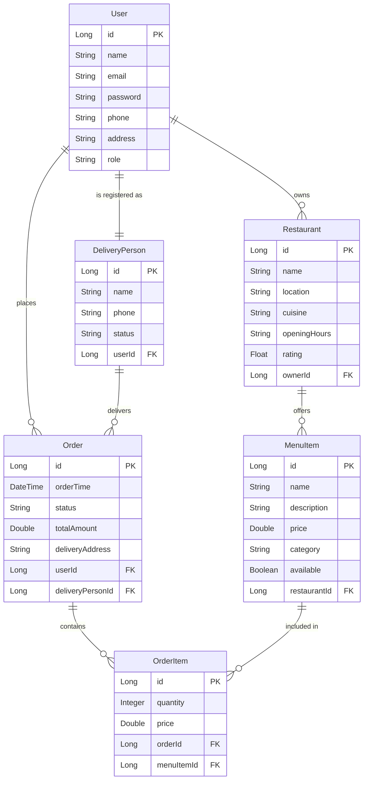

# 🍔 Food Delivery System

<div align="center">
  


</div>

<div align="center">
  
</div>

## 📝 Description

A comprehensive Food Delivery System built with Spring Boot, providing RESTful APIs to manage restaurants, menu items, orders, and users. Perfect for food delivery businesses seeking a robust backend solution.

## ✨ Features

- 🍕 **Menu Management**
  - Add, update, delete, and retrieve menu items
  - Categorize items by restaurant and food type
  - Support for pricing, descriptions, and availability status
  
- 🛒 **Order Processing**
  - Place new orders with multiple items
  - Track order status (Placed, Preparing, Out for Delivery, Delivered)
  - Order history and details retrieval
  
- 👤 **User Management**
  - Customer registration and profile management
  - Restaurant owner/partner registration
  - Delivery personnel management
  - User authentication and authorization

- 🏪 **Restaurant Management**
  - Restaurant registration and profile
  - Opening hours, location, and cuisine types
  - Rating and review system

- 🔍 **Search Functionality**
  - Search restaurants by location and cuisine
  - Filter menu items by category, price range, and rating

- 📊 **Additional Features**
  - Global exception handling for consistent error responses
  - Comprehensive logging and monitoring
  - API documentation with Swagger
  - Performance optimizations

## 🔧 Technology Stack

<div align="center">
  
| Technology | Description |
|------------|-------------|
|  | Core programming language |
|  | Application framework |
|  | Web framework |
|  | Data persistence |
|  | In-memory database (configurable) |
|  | Build tool |
|  | API documentation |
|  | Testing framework |

</div>

## 📋 Prerequisites

Before you begin, ensure you have met the following requirements:

- Java 17 or later
- Maven 3.6+
- Your favorite IDE (IntelliJ IDEA, Eclipse, etc.)
- Postman or any API testing tool (optional)

## ⚙️ Installation & Setup

### 1. Clone the repository

```bash
git clone https://github.com/khan-sk-dev/fooddelivery.git
cd fooddelivery
```

### 2. Configure the database (Optional)

By default, the application uses H2 in-memory database. If you want to use a different database, update the `src/main/resources/application.properties` file:

```properties
# For MySQL
spring.datasource.url=jdbc:mysql://localhost:3306/fooddelivery
spring.datasource.username=your_username
spring.datasource.password=your_password
spring.jpa.properties.hibernate.dialect=org.hibernate.dialect.MySQL8Dialect

# JPA/Hibernate properties
spring.jpa.hibernate.ddl-auto=update
spring.jpa.show-sql=true
spring.jpa.properties.hibernate.format_sql=true
```

### 3. Build the project

```bash
mvn clean install
```

### 4. Run the application

```bash
mvn spring-boot:run
```

### 5. Access the application

The application will be running at [http://localhost:8080](http://localhost:8080)

Swagger API documentation will be available at [http://localhost:8080/swagger-ui.html](http://localhost:8080/swagger-ui.html)

## 🔌 API Endpoints

### Menu Items

| Method | Endpoint | Description |
|--------|----------|-------------|
| POST | `/api/menu-items` | Add a new menu item |
| GET | `/api/menu-items/{id}` | Retrieve a menu item by ID |
| GET | `/api/menu-items/restaurant/{restaurantId}` | Retrieve menu items by restaurant ID |
| PUT | `/api/menu-items/{id}` | Update a menu item |
| DELETE | `/api/menu-items/{id}` | Delete a menu item |

### Orders

| Method | Endpoint | Description |
|--------|----------|-------------|
| POST | `/api/orders/place` | Place a new order |
| GET | `/api/orders/{id}` | Retrieve an order by ID |
| GET | `/api/orders/status/{status}` | Retrieve orders by status |
| PUT | `/api/orders/{id}/status` | Update order status |
| GET | `/api/orders/user/{userId}` | Retrieve orders by user |

### Users

| Method | Endpoint | Description |
|--------|----------|-------------|
| POST | `/api/users` | Create a new user |
| GET | `/api/users/{id}` | Retrieve a user by ID |
| GET | `/api/users/email/{email}` | Retrieve a user by email |
| GET | `/api/users` | Retrieve all users |
| PUT | `/api/users/{id}` | Update user details |
| DELETE | `/api/users/{id}` | Delete a user |

### Restaurants

| Method | Endpoint | Description |
|--------|----------|-------------|
| POST | `/api/restaurants` | Add a new restaurant |
| GET | `/api/restaurants/{id}` | Get restaurant by ID |
| GET | `/api/restaurants/location/{location}` | Find restaurants by location |
| GET | `/api/restaurants/cuisine/{cuisine}` | Find restaurants by cuisine |
| PUT | `/api/restaurants/{id}` | Update restaurant details |
| DELETE | `/api/restaurants/{id}` | Delete a restaurant |

## 🔒 Security & Authentication

The system implements security features to protect user data and restrict access to API endpoints:

- JWT-based authentication
- Role-based authorization (CUSTOMER, RESTAURANT_OWNER, DELIVERY_PERSON, ADMIN)
- Password encryption using BCrypt
- HTTPS support for secure communication

## 🧪 Testing

The project includes comprehensive tests to ensure reliability:

```bash
# Run all tests
mvn test

# Run specific test category
mvn test -Dtest=*ControllerTest

# Generate test coverage report
mvn jacoco:report
```

Test coverage can be viewed at `target/site/jacoco/index.html`

## 🏗️ Project Structure

```
fooddelivery/
├── src/
│   ├── main/
│   │   ├── java/com/khan/fooddelivery/
│   │   │   ├── config/
│   │   │   ├── controller/
│   │   │   ├── dto/
│   │   │   ├── exception/
│   │   │   ├── model/
│   │   │   ├── repository/
│   │   │   ├── security/
│   │   │   ├── service/
│   │   │   ├── util/
│   │   │   └── FoodDeliveryApplication.java
│   │   └── resources/
│   │       └── application.properties
│   └── test/
│       └── java/com/khan/fooddelivery/
│           ├── controller/
│           ├── repository/
│           └── service/
├── .gitignore
├── mvnw
├── mvnw.cmd
├── pom.xml
└── README.md
```

## 📊 Database Schema

<div align="center">
  


</div>

## 📱 Mobile App Integration

The backend system is designed to support both mobile and web applications:

- RESTful API design enables easy integration
- Authentication tokens for secure mobile access
- Push notification support for order updates
- Real-time tracking capabilities
- Optimized for low-bandwidth scenarios

## 🚀 Future Enhancements

- [ ] Payment gateway integration
- [ ] Real-time order tracking with WebSockets
- [ ] AI-based food recommendations
- [ ] Multi-language support
- [ ] Restaurant analytics dashboard
- [ ] Customer loyalty program
- [ ] Scheduled orders and recurring deliveries
- [ ] Route optimization for delivery personnel

## 🔄 CI/CD Pipeline

The project uses GitHub Actions for continuous integration and deployment:

- Automated builds on push
- Test suite execution
- Code quality checks
- Containerization with Docker
- Automatic deployment to staging environments

## 👥 Contributing

Contributions are what make the open-source community such an amazing place to learn, inspire, and create. Any contributions you make are **greatly appreciated**.

1. Fork the Project
2. Create your Feature Branch (`git checkout -b feature/AmazingFeature`)
3. Commit your Changes (`git commit -m 'Add some AmazingFeature'`)
4. Push to the Branch (`git push origin feature/AmazingFeature`)
5. Open a Pull Request


## 📞 Contact

Khan - [@github_username](https://github.com/khan-sk-dev)

Project Link: [https://github.com/khan-sk-dev/fooddelivery](https://github.com/khan-sk-dev/fooddelivery)

---

<div align="center">
  
🍕 Made with ❤️ by [khan-sk-dev](https://github.com/khan-sk-dev) 🍔

</div>
